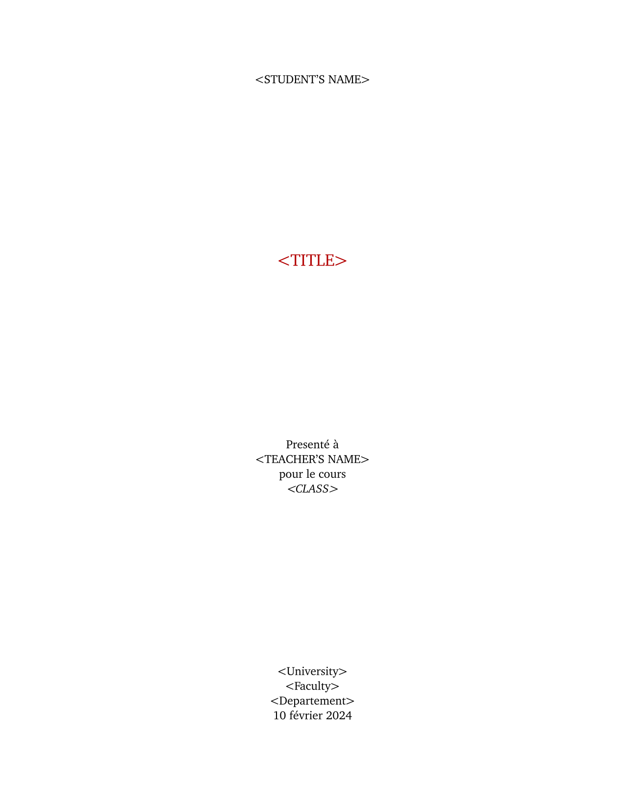
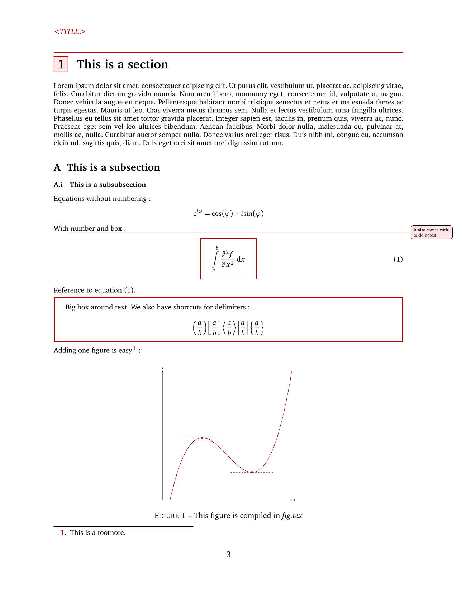
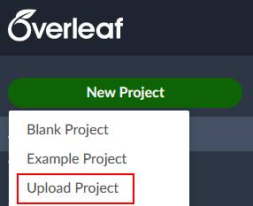

A sweet LaTeX template for your homeworks and other academic assignments!

    
     
    
    
  

  
# Table of contents
- [Table of contents](#table-of-contents)
- [About](#about)
- [Screenshots](#screenshots)
- [Usage](#usage)
  - [Setting things up](#setting-things-up)
  - [How to use](#how-to-use)
    - [Files](#files)
    - [Specifics](#specifics)
- [Roadmap](#roadmap)
- [Credits](#credits)

# About

This is a simple [LaTeX](https://www.latex-project.org) template for homework assignments, more precisly for mathematics and physics. This was originaly intended [Overleaf](https://www.overleaf.com), but it should also work in any TeX environement you might have locally given you use the right compiler (see below).

# Screenshots

<table>
  <tr>
    <td>Title page</td>
    <td>General layout</td>
  </tr>
  <tr>
    <td></td>
    <td></td>
  </tr>
 </table>

You can also preview the whole file in `TeX-JAM.pdf`.

# Usage

## Setting things up

Like mention before, this template was designed for [Overleaf](https://www.overleaf.com). Therefore, we'll only cover how to use this repository on their platform (for now). If you prefer to do things on your local machine, you can use the code in the `TeX-JAM` folder.

1. First you'll need to clone this repository anywhere you want.
2. Then you'll want to head to https://www.overleaf.com and log into your account (or register if you don't have one).
3. Click on the big "New Project" button at the top left.
4. Choose "Upload Project".
5. Then slide or select the `.zip` file inside the `overleaf` folder of this repo.

I suggest importing it and duplicating it each time you start a new assignment instead of re-importing it each time.

**Note:** Overleaf allows direct Github support, but since not every student has access to the paid version of the platform, I made it so anyone could easily upload the project files.

## How to use

### Files

This section goes breifly over each files in the `TeX-JAM` directory. For more information, refer to the files themselves which are decently commented.

- `MAIN.tex`: This is where you'll edit your document.
- `math_func.tex`: Contains the math commands and packages.
- `page_format.sty`: Contains the page formating.
- `special.sty`: This is where special packages are imported and special settings are defined (in this case, for graphs).
- `ref.bib`: Contains the references listed in the [BibTeX](http://www.bibtex.org/) format.
- `figures/fig.tex`: Files such as these are used to compiled figures into pdf files stored in the same directory.

### Specifics

There might be some feature that you do not want to keep:

- Last page left blank: Comment `\blankpage` at the end of `MAIN.tex` to remove.
- Table of contents: Comment `\maketableofcontents` at the start of `MAIN.tex` to remove.
- References: Comment `\makereferences` at the end of `MAIN.tex` to remove.
- Title page: Comment `\maketitlepage` at the start of `MAIN.tex` to remove.

# Roadmap
- [x] Make a decent README
- [x] Refactor file structure
- [ ] Polish the code
- [ ] Make a doc
- [ ] Language Support

# Credits
Special thanks to:
- Alexande Simoneau from which I borrowed some LaTeX commands for math mode.
- David Sénéchal who inspired the page formating.
- [BCarnaval](https://github.com/BCarnaval) for ideas and inspiration.
- [TheoNDionne](https://github.com/TheoNDionne) who suggested various LaTeX commands.
